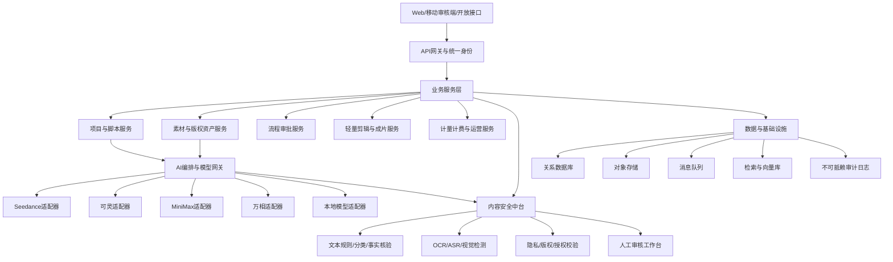

# 行政事业单位 AI 宣传片创作平台 MVP 产品方案

版本：V0.9  
日期：2026 年 6 月 18 日  
暂定产品名：政宣智作

> 本文用于产品立项、需求讨论和技术预研，不构成法律意见。正式商用前应由网信、保密、版权、行业主管部门及法律顾问结合具体部署方式进行专项评估。

---

## 一、项目结论

### 1.1 产品定义

政宣智作不是一个单纯的 AI 视频生成网站，而是：

> 面向党政机关、学校、医院、事业单位和国有企业的，集宣传策划、素材治理、国产模型生成、内容合规审查、多级审批、版权存证和安全发布于一体的 AI 宣传内容生产平台。

平台借鉴通用 AI 视频工作流产品的“脚本—分镜—生成—剪辑—导出”体验，但核心竞争力应放在四个方面：

1. 国产模型的统一接入、动态路由和可替换能力；
2. 面向政务、教育、医疗等场景的内容安全与行业审查；
3. 从素材来源到发布成片的完整证据链和责任链；
4. 政务云、专有云、本地化和信创环境的交付能力。

### 1.2 核心价值

| 客户问题 | 平台价值 |
|---|---|
| 宣传视频制作周期长、外包沟通成本高 | 将文稿、分镜、配音、素材生成和粗剪集中在一个工作流中 |
| 不同人员使用不同 AI 工具，素材和账号失控 | 统一模型入口、统一组织账号、统一资产和调用额度 |
| AI 内容存在政治表述、事实、肖像和版权风险 | 输入、脚本、提示词、生成结果、发布前五道审查 |
| 审批依赖微信、文件和口头沟通，难以追溯 | 多级审批、版本对比、电子意见和全流程日志 |
| 公有模型的数据边界不清晰 | 项目分级、模型白名单、数据去向可视、敏感内容阻断 |
| 生成素材难以证明来源和授权 | 素材授权凭证、模型调用记录、AI 标识和导出清单 |

### 1.3 一句话差异化

通用产品解决“能不能快速生成视频”，本平台解决：

> “一个单位能否安全、合规、可追责地使用国产 AI 完成正式宣传内容。”

---

## 二、目标客户与切入顺序

### 2.1 目标客户

第一层：

- 高校、中小学及教育主管单位；
- 公立医院、疾控与卫生健康相关事业单位；
- 国有企业、地方国企和文化宣传单位；
- 街道、园区、融媒体和基层政务宣传部门。

第二层：

- 地市和区县党政机关；
- 政务服务、司法行政、应急管理、文旅等部门；
- 省级单位及大型政务内容生产中心。

### 2.2 建议切入顺序

建议先从“学校、医院、国企宣传部门”验证产品，再逐步进入党政机关。

原因不是降低合规标准，而是这三类客户：

- 宣传内容频次较高；
- 场景容易模板化；
- 有明确的降本增效诉求；
- 决策和试点周期通常短于大型政务项目；
- 能够较快沉淀教育、医疗、党建、人物宣传等行业模板。

党政机关版本从第一天就按更严格的权限、留痕、部署和审查架构设计，但销售上可通过有政务交付经验的集成商或生态伙伴进入。

### 2.3 首批高频场景

| 场景 | 典型成片 | 建议优先级 |
|---|---|---|
| 政策与工作解读 | 60—180 秒政策动画、数字人口播 | P0 |
| 党建与主题教育 | 主题宣传片、活动回顾、学习短片 | P0 |
| 校园宣传 | 招生、校庆、德育、安全教育、人物事迹 | P0 |
| 医疗科普 | 疾病预防、就诊流程、健康知识 | P0 |
| 活动总结 | 会议、培训、志愿活动、成果汇报 | P0 |
| 典型人物宣传 | 教师、医护、劳模、先进工作者 | P1 |
| 城市与文旅宣传 | 城市形象、非遗、景区和节庆活动 | P1 |
| 应急科普 | 防汛、消防、地震、公共卫生提示 | P1 |
| 新闻播报 | AI 主播、日常简讯 | P2，需单独强化新闻和数字人规则 |

---

## 三、产品原则与业务边界

### 3.1 六项产品原则

1. **合规前置**：审查发生在素材上传和模型调用之前，而不是只检查最终视频。
2. **人机共审**：模型负责发现和解释风险，正式发布责任仍由授权人员承担。
3. **来源优先**：重要事实、政策表述和统计数据应关联单位提供或权威来源。
4. **模型可替换**：业务流程不绑定某一个模型厂商或某一代模型。
5. **最小必要数据**：只向模型发送完成任务所需的最少内容。
6. **全程可追溯**：每一段生成内容都能追溯到素材、提示词、模型、人员和审批记录。

### 3.2 数据与保密边界

平台应在创建项目时要求用户完成数据分类声明：

| 等级 | 内容示例 | 处理策略 |
|---|---|---|
| L0 公开素材 | 已发布政策、官网新闻、公开图片 | 可进入获准的互联网模型 |
| L1 单位内部一般信息 | 未发布活动素材、普通内部文稿 | 仅进入专有空间或经批准模型，限制下载和外发 |
| L2 敏感信息 | 身份信息、患者资料、学生资料、人脸和声音 | 脱敏、单独授权、最小化处理，优先本地能力 |
| L3 重要或高风险内容 | 重大政策未定稿、重要数据、重要人物相关内容 | 指定人员审批，限制模型范围，原则上不进入公共模型 |
| L4 涉密或禁止处理内容 | 国家秘密及单位明确禁止外传的信息 | 标准平台直接阻断，不得上传、解析或调用互联网模型 |

必须在产品、合同和销售材料中明确：

> “本地部署”不等于“自动具备处理国家秘密的资格”。涉密信息系统需要按照保密法律法规和主管要求另行规划、建设、测评和管理，不能作为普通私有化版本的一项开关。

### 3.3 平台不应承诺的事项

- 不承诺 AI 自动审查可以替代单位政治审查、保密审查或行业终审；
- 不允许未经授权生成或仿冒领导干部、公众人物及普通个人的脸部和声音；
- 不允许把患者病历、学生档案、未发布政策材料直接提交公共模型；
- 不自动把生成内容作为新闻事实或正式政策文本发布；
- 不以“AI 原创”替代音乐、字体、图片、人物肖像等权利核验；
- 不默认支持用户去除依法应当保留的 AI 生成合成内容标识。

---

## 四、用户角色与权限

### 4.1 标准角色

| 角色 | 主要权限 |
|---|---|
| 组织管理员 | 组织、部门、用户、模型、额度、策略和数据范围管理 |
| 项目负责人 | 创建项目、分派成员、提交审批、管理项目资产 |
| 策划/文案 | 资料整理、选题、脚本和旁白编辑 |
| 设计/制作 | 分镜、画面生成、配音、字幕、剪辑和包装 |
| 内容审核员 | 政治表述、事实、行业内容和视觉规范审核 |
| 保密/数据审核员 | 数据级别、个人信息、素材外发和模型使用范围审核 |
| 版权审核员 | 素材授权、字体、音乐、肖像和生成证明审核 |
| 部门审批人 | 对本部门发布内容进行业务审批 |
| 终审/发布人 | 最终签发、导出和发布授权 |
| 审计员 | 只读查看日志、审批记录、模型调用和导出记录 |
| 外部协作方 | 在受限空间上传或编辑指定内容，不可查看其他项目 |

### 4.2 权限模型

采用 RBAC 与 ABAC 结合：

- RBAC 决定用户可以使用哪些功能；
- ABAC 根据部门、项目密级、素材级别、设备、网络区域、时间和模型等级决定是否放行；
- 导出、删除、跨部门共享、调用高风险模型等操作必须单独授权；
- 审核员不能审批自己创建并制作的最终内容；
- 高风险项目至少实行制作与审批相分离。

---

## 五、端到端业务流程


### 5.1 创建任务

用户选择：

- 单位、部门、项目负责人；
- 使用场景和模板；
- 目标受众；
- 成片比例、时长、语言和发布渠道；
- 数据等级、是否包含人脸/声音/未成年人/健康信息；
- 计划完成时间和审批流程。

系统根据选择自动加载相应政策包、模板包、禁用能力和审批链。

### 5.2 导入资料

支持：

- 文档、PDF、网页、图片、音视频；
- 单位知识库、官网内容和历史宣传稿；
- 素材授权书、肖像授权、音乐许可和字体许可；
- 结构化填写政策依据、统计数字、时间和发布机关。

系统为资料生成来源卡片，记录文件摘要、上传人、时间、适用范围和有效期。

### 5.3 脚本生成

AI 只基于获准资料生成：

- 选题角度；
- 片名和传播标题；
- 三段式或多段式结构；
- 旁白、字幕和画面建议；
- 事实引用与来源脚注；
- 不同平台版本，如横屏正式版、竖屏短视频版。

脚本编辑器必须显示“有来源内容”和“模型推演内容”的区别。

### 5.4 分镜生成

每个镜头包含：

- 镜头编号和时长；
- 景别、机位、运镜；
- 人物、场景、动作和情绪；
- 旁白、同期声、字幕和音效；
- 参考素材；
- 计划使用的模型；
- 风险标签和审核状态。

用户可以锁定人物、单位建筑、品牌色、服装、Logo 和整体视觉风格。

### 5.5 模型生成

模型网关根据以下条件路由：

- 项目数据等级；
- 素材是否含真人、声音、未成年人或敏感个人信息；
- 模型是否完成必要备案或登记；
- 模型的数据存储和训练政策；
- 文生视频、图生视频、首尾帧、参考角色、视频编辑等能力；
- 画质、时长、预计成本、排队时间和历史通过率；
- 单位管理员配置的模型白名单。

### 5.6 合成与剪辑

MVP 提供“轻剪辑”而不是复制专业 NLE：

- 镜头排序和时长调整；
- 自动字幕、字幕校对和敏感词提示；
- 旁白、背景音乐和音量平衡；
- 片头片尾、角标、Logo、安全区和统一色彩；
- 横竖屏智能重排；
- 一键生成预审版、送审版和发布版。

### 5.7 审批与发布

建议默认审批链：

制作人提交 → 项目负责人初审 → 内容/行业审核 → 数据或版权审核 → 部门负责人终审 → 授权导出。

高风险项目可以增加宣传、保密、法务或分管领导节点。

---

## 六、“一项声明、五道闸门、四类证据”审查体系

### 6.1 一项声明

项目创建时完成“数据和内容使用声明”，包括：

- 是否包含内部资料；
- 是否包含个人信息、敏感个人信息或未成年人信息；
- 是否包含真人肖像或声音；
- 是否包含地图、国旗、党旗党徽、重要机构标志；
- 是否涉及医疗建议、教育评价、突发事件、民族宗教等高风险主题；
- 是否允许调用公共云模型；
- 计划发布渠道和受众范围。

### 6.2 五道闸门

#### 闸门一：输入资料审查

检查上传文件和用户输入：

- 涉密、内部敏感和个人信息识别；
- OCR、ASR 和文档解析；
- 文件病毒、恶意脚本和异常格式；
- 肖像、声音和素材授权状态；
- 来源真实性和有效期；
- 允许进入的模型和网络区域。

#### 闸门二：脚本与事实审查

检查：

- 政治方向、意识形态和禁止性内容；
- 党和国家机构、职务、政策名称和规范表述；
- 时间、地点、人物、数字、政策依据等事实；
- 夸大、绝对化、歧视、污名化和不当类比；
- 医疗、教育、应急等行业专业表达；
- 可能造成误解的 AI 补写内容。

重要表述应尽可能回链到用户提供的权威资料，无法核实的内容标记为“待人工确认”，不得自动通过。

#### 闸门三：提示词与模型调用审查

在请求发给模型前检查：

- 提示词是否包含禁用或敏感数据；
- 是否试图生成特定真人、领导干部或未经授权声音；
- 目标模型是否在当前项目白名单；
- 发送给模型的内容是否已经脱敏；
- 请求是否符合供应商接口政策；
- 是否需要切换为本地模型、专有实例或人工制作。

#### 闸门四：生成结果多模态审查

同时分析画面、语音、字幕和背景元素：

- OCR 检查标语、标牌、文件和生成文字；
- ASR 复核旁白、人物对白和口型语音；
- 人脸、相似人物、年龄和未成年人识别；
- 国旗、党旗党徽、地图、制服、证件和机构标志规范；
- 色情、暴力、恐怖、迷信、歧视和危险行为；
- 医疗器械、操作动作和诊疗表述；
- 版权相似性、第三方水印、Logo 和疑似受保护角色；
- 音乐、字体、图片和声音授权状态；
- 画面畸变、错误文字、虚构建筑或不恰当人物行为。

#### 闸门五：发布前审查

检查完整成片而不是单个镜头：

- 上下文是否造成新的歧义或错误导向；
- 字幕、旁白、画面和数据是否一致；
- 发布渠道、受众、发布时间和审批链是否匹配；
- 是否已添加要求的显式、隐式生成合成内容标识；
- 版权清单、授权凭证和模型记录是否完整；
- 终审人是否具备当前项目的签发权限。

### 6.3 四类证据

每个成片自动生成“合规证据包”：

1. **来源证据**：政策资料、数据来源、引用段落和版本；
2. **权利证据**：肖像、声音、字体、图片、音乐和第三方素材授权；
3. **生成证据**：模型名称、版本、备案信息、提示词摘要、时间和任务编号；
4. **责任证据**：修改记录、风险项处置、审批意见、终审人和导出记录。

### 6.4 风险处置

| 风险级别 | 系统动作 |
|---|---|
| R0 无明显风险 | 自动进入下一环节 |
| R1 一般提示 | 允许继续，记录提示 |
| R2 需要修改 | 阻止提交审批，修改后复检 |
| R3 高风险 | 冻结当前内容，指定审核员人工处理 |
| R4 禁止或疑似涉密 | 阻断上传/生成/导出，触发安全事件记录 |

审查系统不能只使用一个大模型判断。建议由规则库、敏感信息识别、小模型分类器、OCR/ASR、计算机视觉、来源核验和人工复核共同决策。

---

## 七、行业审查包

### 7.1 党政与公共宣传包

- 机构、职务、政策和会议名称规范；
- 党旗党徽、国旗国徽和重要标识使用检查；
- 重大主题、重要时间节点和历史表述检查；
- 地图和行政区划素材来源与规范检查；
- 领导干部形象、声音和讲话内容限制；
- 数据、排名、成果和政策效果的来源核验；
- 新闻与宣传内容边界提示。

### 7.2 教育场景包

- 未成年人个人信息和肖像授权；
- 校园欺凌、自伤、危险模仿等内容识别；
- 招生、升学、排名和教育效果表述；
- 教材、试题、课程和教师作品版权；
- 学生姓名、班级、成绩和家庭信息脱敏；
- 面向未成年人内容的年龄适宜性审查。

### 7.3 医疗场景包

- 健康和病历等敏感个人信息识别；
- 患者肖像、病例和知情授权；
- 疾病、药品、器械、诊疗和急救表述核验；
- 避免把科普内容表述为个体诊断；
- 禁止夸大疗效、保证治疗结果或误导就医；
- 医疗操作画面和专业术语人工复核。

行业包以“规则、词库、模板、审批链和知识源”形式配置，不能只依赖通用提示词。

---

## 八、国产模型接入与调度设计

### 8.1 首批接入范围

截至 2026 年 6 月 18 日，可优先调研：

| 厂商/模型 | 平台中的主要用途 | 接入关注点 |
|---|---|---|
| 火山引擎 Seedance 2.0 | 多模态参考生视频、视频编辑和延长 | 素材限制、真人能力政策、结果存储时效、企业服务条款 |
| 可灵 3.0 / 3.0 Omni | 多镜头、参考一致性、音画生成 | 国内 API 可用型号、企业并发、真人和声音授权机制 |
| MiniMax 视频模型/海螺 | 文生视频、图生视频、首尾帧和主体参考 | 国内区域、版本能力、生成时长、审核返回信息 |
| 阿里云百炼万相 2.7 等 | 文生视频、图生视频、参考生视频和视频编辑 | 地域 Endpoint、工作空间隔离、模型版本和数据策略 |
| 国产文本模型 | 选题、脚本、摘要、审核解释、知识库问答 | 备案、私有化能力、上下文和事实可靠性 |
| 国产语音模型 | TTS、声音转换、ASR、字幕 | 真人声音授权、方言、可追溯水印和本地化能力 |

模型版本变化很快，产品界面不应把能力写死。模型注册中心应维护：

- 厂商、模型和版本；
- API 区域和数据流向；
- 支持的输入输出模态；
- 真人、声音、未成年人等使用限制；
- 内容审核机制和错误码；
- 成本、并发、时长、画质和平均耗时；
- 备案或登记信息；
- 服务条款版本和生效日期；
- 当前允许使用的项目等级。

### 8.2 统一模型网关

对上提供统一任务协议：

```json
{
  "task_type": "image_to_video",
  "project_level": "L1",
  "prompt": "...",
  "negative_prompt": "...",
  "references": [],
  "duration": 10,
  "aspect_ratio": "16:9",
  "audio_mode": "separate",
  "policy_profile": "gov_publicity_v1",
  "preferred_models": [],
  "data_region": "cn-mainland"
}
```

对下使用不同厂商适配器完成参数转换、任务提交、轮询、结果转存、异常重试和计量。

### 8.3 路由策略

路由评分建议：

```text
可用性硬门槛
× 数据安全匹配
× 内容政策匹配
× 画面任务匹配
× 历史审查通过率
× 质量评分
× 时延评分
× 成本评分
```

涉及数据等级、真人或声音授权时使用硬规则，不允许为了降低成本绕过。

### 8.4 降级策略

- 目标模型不可用时切换到同安全等级的备用模型；
- 若无合规备用模型，停止任务并提示用户；
- 不在用户不知情时跨地域或切换到境外接口；
- 供应商返回审核拒绝时保留原因，不通过自动改写绕过供应商安全策略；
- 生成结果链接应立即转存到受控对象存储，避免过期或外链泄露。

---

## 九、MVP 功能范围

### 9.1 P0：第一版必须完成

#### A. 组织与权限

- 多租户、部门、角色和项目空间；
- 组织实名认证及受控邀请；
- 项目数据等级和模型白名单；
- 操作、登录、调用和导出日志。

#### B. 项目创建

- 场景模板；
- 目标受众、渠道、时长和比例；
- 数据分类声明；
- 审批流程自动匹配。

#### C. 资料与知识

- 文档、图片、音视频上传；
- OCR、ASR、摘要和来源卡片；
- 项目级知识库；
- 资料引用和事实待核验标记。

#### D. 脚本工作台

- 大纲、脚本、旁白和字幕生成；
- 政策口径模板；
- 来源引用；
- 版本对比、批注和锁定段落；
- 脚本预审。

#### E. 分镜工作台

- 脚本自动拆镜；
- 镜头卡片编辑；
- 参考图和风格板；
- 人物、场景、品牌资产锁定；
- 单镜头重新生成。

#### F. 国产模型网关

- 至少接入两家视频模型和一家图像/文本模型；
- 异步任务、状态、失败重试和结果转存；
- 成本与额度统计；
- 管理员模型开关。

#### G. 轻量成片

- 时间线排序、裁切、转场；
- TTS、音乐、字幕和音量；
- 片头片尾和单位模板；
- 横屏、竖屏导出；
- 预审水印和正式导出。

#### H. 内容安全

- 输入与输出敏感信息检查；
- 文本、OCR、ASR 和基础视觉审核；
- 风险清单和处置闭环；
- 高风险人工审核队列；
- AI 显式标识和文件元数据标识。

#### I. 审批与归档

- 可配置多级审批；
- 审批意见和版本冻结；
- 成片证据包；
- 导出授权和归档记录。

### 9.2 P1：试点后扩展

- 数字人播报和单位专属声音；
- 多人协同实时编辑；
- 版权相似度检索；
- 地图、旗帜、标志的专用视觉检测；
- 自动生成多平台文案、封面和短切版本；
- 与 OA、统一身份认证、电子签章和融媒体平台对接；
- 手机端审核；
- 供应商质量与通过率看板；
- 成片复用和一键改版。

### 9.3 P2：规模化阶段

- 完整行业知识库和区域政策库；
- 本地视频生成模型部署；
- 多智能体策划与自动制片；
- 高级时间线、绿幕、口型和角色一致性；
- 省市级多单位内容中台；
- 创作服务商市场；
- 内容发布后的舆情反馈和版本回收。

### 9.4 明确不做

MVP 不做：

- 对标 Premiere、剪映专业版的完整剪辑能力；
- 面向大众用户的开放社区；
- 无审核的模板商城；
- 任意真人换脸、克隆声音；
- 自动发布到所有外部平台；
- 自研基础视频大模型。

---

## 十、信息架构与核心页面

### 10.1 一级导航

```text
工作台
项目中心
审核中心
资产中心
模板中心
知识库
模型与额度
合规中心
审计中心
组织管理
```

### 10.2 首页工作台

首页展示：

- 待我处理：待修改、待审核、待审批；
- 最近项目和成片进度；
- 当前模型余额和异常；
- 本单位风险趋势；
- 常用模板；
- 最新政策包和规则更新提示。

### 10.3 新建项目向导

分四步：

1. 选择场景模板；
2. 填写宣传目标和成片规格；
3. 声明数据、人物和版权情况；
4. 确认模型范围和审批流程。

完成后生成项目合规卡，持续显示项目等级和禁止事项。

### 10.4 脚本工作台

```text
┌────────────资料与来源────────────┬────────────脚本编辑器────────────┬────风险与批注────┐
│ 权威文件                         │ 片名 / 大纲 / 旁白 / 字幕         │ 待核事实 3       │
│ 单位知识库                       │ 每段显示来源编号和版本差异         │ 表述风险 1       │
│ 历史宣传稿                       │ AI改写 / 缩写 / 分平台版本          │ 审核意见         │
└───────────────────────────────┴───────────────────────────────┴────────────────┘
```

关键体验：

- 点击脚本文句可查看来源；
- 没有来源的数字或政策表述醒目标记；
- AI 建议以修订模式出现，不直接覆盖人工内容；
- 审核通过的段落可锁定，防止后续生成时被改写。

### 10.5 分镜工作台

左侧为脚本段落，中间为镜头卡片，右侧为生成和风险面板。

镜头卡片操作：

- 生成四个画面候选；
- 选定参考图后生成视频；
- 锁定人物、服装、场景和单位标志；
- 查看提示词、模型、成本、风险和历史版本；
- 将失败镜头切换到备用模型。

### 10.6 审核中心

按风险项而不是按文件堆叠：

- 风险类型；
- 命中的画面时间点或文本位置；
- 规则依据；
- 系统解释和建议动作；
- 原始版本与修改版本对比；
- 通过、退回、升级审核或禁止使用。

审核意见必须结构化保存，不能只保存一句“已修改”。

### 10.7 成片与审批页

- 左侧播放成片；
- 下方时间轴显示风险点和修改点；
- 右侧显示审批链、版权完整度、AI 标识和证据包状态；
- 只有全部必需节点通过后才出现正式导出按钮。

### 10.8 合规中心

管理员可管理：

- 内容政策包和行业规则；
- 敏感词及其上下文规则；
- 模型使用等级；
- 版权、肖像和声音授权模板；
- AI 标识策略；
- 风险事件和处置时限；
- 规则版本及生效范围。

---

## 十一、技术架构



### 11.1 推荐技术栈

MVP 建议：

- 前端：Vue 3、TypeScript；
- 核心业务：Java、Spring Boot；
- AI 编排与媒体分析：Python、FastAPI；
- 工作流：Flowable/BPMN；
- 异步任务：RabbitMQ 或 Kafka；
- 数据库：PostgreSQL，预留达梦、人大金仓、OceanBase 等适配层；
- 缓存：Redis 兼容产品；
- 对象存储：S3 协议兼容存储或国产云对象存储；
- 检索：OpenSearch/Elasticsearch 兼容方案；
- 向量检索：pgvector 或可替换的国产向量数据库；
- 媒体处理：FFmpeg；
- 部署：容器化、Kubernetes，可适配麒麟、统信及主流国产 CPU 环境；
- 密钥：集中密钥管理，不在代码或配置文件中保存供应商密钥。

### 11.2 核心服务

1. 统一身份与租户服务；
2. 项目和协作服务；
3. 知识库与来源服务；
4. 素材、版权和授权服务；
5. 脚本与分镜服务；
6. 模型注册和统一网关；
7. 内容安全策略引擎；
8. 多模态审查服务；
9. 媒体合成服务；
10. 流程审批服务；
11. AI 标识和内容溯源服务；
12. 调用计量和成本服务；
13. 审计和安全事件服务。

### 11.3 关键数据对象

- Organization、Department、User、Role；
- Project、ProjectClassification、Channel；
- SourceDocument、SourceCitation；
- Asset、AssetVersion、RightsLicense、Consent；
- Script、ScriptVersion、Storyboard、Shot；
- Prompt、GenerationJob、ModelSnapshot；
- GeneratedAsset、MediaFingerprint；
- RiskFinding、ReviewDecision；
- ApprovalFlow、ApprovalTask；
- ExportPackage、AILabel、ArchiveRecord；
- AuditEvent、SecurityIncident。

模型版本、策略版本和授权状态必须生成快照，避免以后规则变化导致历史记录无法解释。

### 11.4 安全设计

- 传输和存储加密；
- 租户级和项目级数据隔离；
- 文件上传查毒和格式净化；
- DLP、敏感数据识别和脱敏；
- 模型 API 密钥集中托管和定期轮换；
- 外部接口域名白名单；
- 导出水印、下载控制和链接有效期；
- 高风险操作双人确认；
- 审计日志防篡改和定期归档；
- 供应链组件清单、漏洞扫描和升级机制；
- 备份恢复、灾备和安全事件响应预案。

---

## 十二、部署版本

### 12.1 SaaS 标准版

适合只处理公开宣传素材的学校、医院、国企和基层单位。

- 国内云区域；
- 多租户逻辑隔离；
- 仅允许调用批准的国内模型；
- 不允许上传涉密内容；
- 提供组织管理、合规审查和审批流程。

### 12.2 专属云/专有空间版

适合中大型单位：

- 独立存储、独立密钥和专属模型账号；
- 专属网络策略和访问域名；
- 可对接统一身份、OA 和对象存储；
- 数据不进入公共素材池；
- 支持更严格的运维和审计。

### 12.3 本地私有化非涉密版

适合数据不便离开单位环境但不属于国家秘密的客户：

- 业务、素材、知识库和审查能力本地部署；
- 可通过受控出口调用国内云模型；
- 支持完全本地的文本、OCR、ASR 和部分生成能力；
- 提供信创适配和离线升级包。

### 12.4 涉密场景

不作为普通 SKU 销售。若客户提出需求，应：

- 先由客户保密部门明确业务和信息范围；
- 由具备相应能力和资质的生态伙伴参与；
- 将网络、设备、模型、数据、运维和人员作为独立体系设计；
- 不复用互联网 SaaS 的模型接口、日志链路和远程运维体系。

---

## 十三、合规基线

截至 2026 年 6 月 18 日，项目至少应重点评估：

- 《中华人民共和国网络安全法》（2025 年修正，2026 年 1 月 1 日起施行）；
- 《中华人民共和国数据安全法》；
- 《中华人民共和国个人信息保护法》；
- 《网络数据安全管理条例》（2025 年 1 月 1 日起施行）；
- 《生成式人工智能服务管理暂行办法》；
- 《互联网信息服务深度合成管理规定》；
- 《人工智能生成合成内容标识办法》（2025 年 9 月 1 日起施行）；
- 强制性国家标准 GB 45438—2025《网络安全技术 人工智能生成合成内容标识方法》；
- 《个人信息保护合规审计管理办法》（2025 年 5 月 1 日起施行）；
- 《中华人民共和国保守国家秘密法》及其实施条例；
- 《中华人民共和国著作权法》；
- 《未成年人网络保护条例》；
- 医疗、教育、新闻出版、广播电视、地图和广告等具体行业规定。

如果平台面向社会公众提供具有舆论属性或者社会动员能力的生成式人工智能或深度合成服务，还应结合实际服务形态评估算法备案、生成式人工智能服务备案或登记、实名认证、内容管理和公示义务。

产品应建立“法规—控制措施—功能—证据”的映射表，便于客户测评、采购和审计。

---

## 十四、商业模式

### 14.1 收入结构

1. 软件年度订阅；
2. 模型生成额度包；
3. 专属云或私有化许可；
4. 实施、集成和信创适配；
5. 行业政策包和模板包；
6. 培训、代运营和人工创作服务；
7. 年度运维、安全升级和规则更新。

### 14.2 初步价格假设

以下只用于市场访谈，不宜直接作为正式报价：

| 产品 | 建议区间 |
|---|---|
| 小型单位 SaaS | 2.98—9.8 万元/年 |
| 单位专业版 | 12—30 万元/年 |
| 专属空间版 | 25—60 万元/年 |
| 私有化非涉密版 | 60—200 万元起 |
| 年度运维 | 软件合同额的 15%—20% |
| 行业模板/政策包 | 3—20 万元/包 |
| 人工创作服务 | 按项目或年度框架协议 |

模型费用建议采用“平台基础额度 + 超额资源包”，同时向客户展示项目成本，但不暴露复杂的底层供应商计价。

### 14.3 采购形态

- 标准软件采购；
- 软件服务年度订阅；
- 政务云应用服务；
- 私有化项目建设；
- “平台 + 内容生产服务”框架采购；
- 与融媒体、OA、门户或数字政府项目联合建设。

---

## 十五、90 天 MVP 计划

### 阶段一：0—30 天

- 完成客户访谈和三类行业样本收集；
- 确定数据分级、五道审查和标准审批流；
- 完成产品原型和技术验证；
- 接通一家文本模型、一家图像模型和一家视频模型；
- 验证字幕、配音、FFmpeg 合成和结果转存；
- 建立第一版风险词库和规则库。

### 阶段二：31—60 天

- 完成项目、脚本、分镜、生成任务和轻剪辑主流程；
- 接入第二家视频模型；
- 实现 OCR、ASR、文本审核和基础视觉审核；
- 完成多级审批、版本冻结和日志；
- 实现素材授权和版权清单；
- 上线学校、医院、党建三套模板。

### 阶段三：61—90 天

- 完成 AI 显式/隐式标识；
- 完成合规证据包和导出；
- 进行权限、隔离、接口和安全测试；
- 与 2—3 家试点单位进行真实项目测试；
- 根据误报、漏报、使用时长和生成成本调整；
- 形成 SaaS 演示版与私有化部署清单。

### 15.1 建议团队

最小团队约 10—13 人：

- 产品负责人 1；
- 行业/合规产品 1；
- 交互与视觉设计 1；
- 前端 2；
- Java 后端 2；
- AI/模型编排 2；
- 音视频工程 1；
- 测试 1；
- DevOps/安全 1；
- 兼职法律、版权、政务和医疗教育顾问。

---

## 十六、MVP 验收指标

建议把以下数字作为试点目标，而不是外部承诺：

### 16.1 效率

- 60—90 秒模板化宣传片在资料齐备后 4 小时内形成可送审初稿；
- 脚本到分镜的首次生成时间不超过 5 分钟；
- 单镜头任务状态、成本和失败原因 100% 可见；
- 常规项目可在一个平台完成，不依赖多个个人 AI 账号。

### 16.2 合规

- 模型调用、提示词摘要、素材和审批记录留痕率 100%；
- 正式导出项目的必需授权和审批完整率 100%；
- L4 内容在模型调用前阻断；
- AI 标识添加成功率 100%；
- 高风险内容必须经过人工审核，不允许自动放行。

### 16.3 质量

- 试点单位对脚本可用性评分达到 80% 以上；
- 模板化项目第一次送审通过率目标 70% 以上；
- 同一人物、场景和品牌资产的镜头一致性持续提升；
- 生成失败后可恢复，不要求用户重复创建整个项目。

### 16.4 商业验证

- 至少 3 家试点单位；
- 至少 2 家愿意付费或签署明确采购意向；
- 每家单位每月形成 5 个以上真实项目；
- 平台模型成本控制在客户可接受的项目预算内。

---

## 十七、首批原型建议

第一轮只设计八个高保真页面：

1. 首页工作台；
2. 新建项目四步向导；
3. 项目资料与来源页；
4. 脚本工作台；
5. 分镜生成工作台；
6. 轻量剪辑与成片页；
7. 风险审核中心；
8. 终审、证据包与导出页。

演示主故事建议使用：

> “某市公立医院制作一条 90 秒春季传染病预防科普片。”

这个案例可以同时展示权威资料引用、医疗内容审核、真人素材限制、国产模型路由、字幕配音、人工审批和 AI 标识，较容易让客户理解平台与普通 AI 视频工具的区别。

---

## 十八、立项后的优先决策

在进入开发前，需要管理层明确六件事：

1. 首个付费行业是学校、医院、国企还是基层政务；
2. 第一版是 SaaS 优先，还是专有云/私有化优先；
3. 是否自行申请相关备案和运营资质，还是只作为单位内部生产工具；
4. 首批接入的两家视频模型及商务条件；
5. 内容安全中台自建到什么程度，哪些能力采购；
6. 是否同时提供人工策划、制作和审核服务。

我的建议是：

- 首行业选择医院或高校；
- 产品采用 SaaS 演示版 + 可部署架构；
- 首版定位内部创作与审核工具，不开放公众内容社区；
- 接入两家视频模型形成可替换能力；
- 文本和流程规则自建，基础机审能力采购与自建结合；
- 商业上提供“软件 + 模型额度 + 人工服务”的组合。

---

## 十九、官方参考资料

1. [《生成式人工智能服务管理暂行办法》](https://www.cac.gov.cn/2023-07/13/c_1690898327029107.htm)
2. [《互联网信息服务深度合成管理规定》](https://www.cac.gov.cn/2022-12/11/c_1672221949354811.htm)
3. [《人工智能生成合成内容标识办法》](https://www.cac.gov.cn/2025-03/14/c_1743654684782215.htm)
4. [GB 45438—2025《网络安全技术 人工智能生成合成内容标识方法》](https://std.samr.gov.cn/gb/search/gbDetailed?id=301E0388CB75788DE06397BE0A0AE1B4)
5. [《网络数据安全管理条例》](https://www.cac.gov.cn/2024-09/30/c_1729384452307680.htm)
6. [《中华人民共和国个人信息保护法》](https://www.cac.gov.cn/2021-08/20/c_1631050028355286.htm)
7. [《中华人民共和国数据安全法》](https://www.cac.gov.cn/2021-06/11/c_1624994566919140.htm)
8. [《中华人民共和国网络安全法》（2025 年修正）](https://www.cac.gov.cn/2025-12/29/c_1768735112911946.htm)
9. [《个人信息保护合规审计管理办法》](https://www.cac.gov.cn/2025-02/14/c_1741233507681519.htm)
10. [《中华人民共和国保守国家秘密法》（2024 年修订）](https://www.ssf.gov.cn/portal/rootfiles/2024/03/25/1713038527579105-1713038527601412.pdf)
11. [《中华人民共和国保守国家秘密法实施条例》（2024 年修订）](https://www.ssf.gov.cn/portal/rootfiles/2024/08/23/1726098035285451-1726098035293140.pdf)
12. [《未成年人网络保护条例》](https://www.cac.gov.cn/2023-10/24/c_1699806932316206.htm)
13. [Seedance 2.0 火山方舟官方教程](https://www.volcengine.com/docs/82379/2291680)
14. [可灵 3.0 官方介绍](https://ir.kuaishou.com/zh-hans/news-releases/news-release-details/keling30xiliemoxingquanmianshangxian/)
15. [MiniMax 视频生成官方文档](https://platform.minimax.io/docs/guides/video-generation)
16. [阿里云百炼万相文生视频 API](https://help.aliyun.com/zh/model-studio/text-to-video-api-reference)

